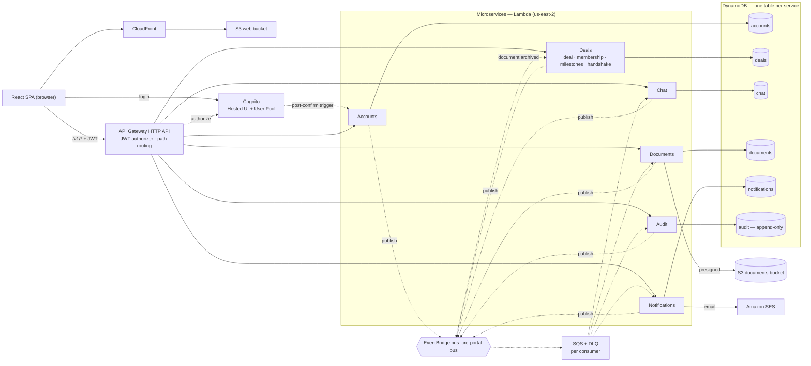

# CRE Transaction Portal — Design Document

## 1. Overview

A neutral, per-deal web portal for executing a commercial property purchase.
Every party to the transaction — buyer, seller, both agents, both attorneys,
lender, title/escrow, and third-party contributors like inspectors — is a
first-class member of one shared workspace, rather than a guest on somebody
else's brokerage or title system.

The portal provides three things over a fixed milestone backbone:

1. **A single source of truth** — scoped, threaded communication per deal.
2. **A document room** — versioned, permissioned, with document requests.
3. **An append-only audit trail** — who did / saw / changed what, and when.

It also adds a **dual-approval ("handshake") workflow** so that irreversible or
bilateral actions (advancing a stage, deleting a document, changing price) can't
be done unilaterally once the deal is firm.

The system is built as **six independently deployed microservices** — Accounts,
Deals, Chat, Documents, Notifications, Audit — behind a single API gateway,
communicating asynchronously over an EventBridge bus, each owning its own
DynamoDB table (see [§7](#7-architecture)).

See `docs/01-problem-exploration.md` for why this problem was chosen.

## 2. Goals and non-goals

### Goals (V1)

- One workspace per deal; all parties first-class; server-enforced role- and
  scope-based access.
- The standard commercial purchase pipeline as a guided, forward-only sequence
  of stages with per-stage checklists.
- Threaded messaging with four visibility scopes and delivery/read receipts.
- A document room with explicit versioning, scoped access, promotion of
  side-private documents to deal-wide, and a document-request workflow.
- A complete, scoped, exportable audit trail.
- An in-app notification centre; email only for invitations and
  "action-required" events.
- Real authentication; deployed to AWS; runs on seed data with no external
  integrations.

### Non-goals (V1)

- No wire/payment handling or identity verification (problem 1).
- No deadline/contingency automation or reminders (problem 5) — checklists are
  manual.
- No in-app bidding or pre-contract sourcing; a deal starts at an accepted offer.
- No e-signature, no MLS/title/lender integrations, no real-time push, no
  multi-tenant billing, no mobile app.
- Single region, US/English, USD only.

Full deferred list in [§13 Future work](#13-future-work).

## 3. Users and roles

| Role | Side | Notes |
|---|---|---|
| `SELLER_AGENT` | sell | Deal creator and **sole admin**. |
| `SELLER` | sell | Principal. |
| `SELLER_ATTORNEY` | sell | |
| `BUYER` | buy | Buy-side **handshake lead** — either the buyer or the buyer's agent can act. |
| `BUYER_AGENT` | buy | Buy-side **handshake lead**; can invite other buy-side members (within limits). |
| `BUYER_ATTORNEY` | buy | |
| `LENDER` | buy | Full buy-side member; not a handshake lead; cannot invite/remove. |
| `TITLE_AGENT` | neutral | Deal-wide only; never in side-private threads/docs or channels; not in handshakes; invited by admin only. |
| `OTHER` | assigned on invite | Third-party contributor (inspector, appraiser, consultant). Reads deal-wide; reads/posts/uploads **only** within its own side's private scope; no deal-wide posting, no cross-side channels. |

**Buy-side roster limits:** ≤ 2 agents, ≤ 2 attorneys, ≤ 7 buy-side members
total (all roles, including `LENDER` and `OTHER`, count toward 7).

**Registration:** the selling side self-registers through open sign-up. Everyone
else joins strictly by email invitation. The first self-registered user on a
deal is its admin.

## 4. Core concepts

- **Deal** — one accepted offer on one property. Has lifecycle `status`
  (`ACTIVE` → `CLOSED` | `CANCELLED`) which is orthogonal to milestone progress.
  On `CLOSED`/`CANCELLED` the workspace is read-only but fully viewable — it
  becomes the permanent record.
- **Milestone pipeline** (forward-only, one step at a time, no regression in V1):
  1. **Offer Accepted / PSA Negotiation** — attorneys draft & negotiate the
     binding PSA; signing + earnest-money deposit puts the property under
     contract.
  2. **Attorney Review** — counsel finalizes contract language; either side may
     still walk. **Completing this flips the deal's `firm` flag.**
  3. **Due Diligence** — PCA, Phase I/II environmental, zoning, leases &
     estoppels, service contracts, financials. Buyer can terminate and recover
     the deposit before the DD deadline.
  4. **Financing** — loan application, lender appraisal, underwriting,
     clear-to-close.
  5. **Title & Survey** — title commitment + ALTA survey; cure or insure over
     exceptions.
  6. **Closing** — settlement statements, funds + loan wired to escrow, deed
     executed & recorded; post-closing items.
- **`firm`** — true once Attorney Review is completed. Drives which actions
  require a handshake.
- **Membership** — `(user, deal, role, side, status)`; `status` ∈ `invited` /
  `active` / `removed`. Removal is soft; the member's past messages and uploads
  stay attributed.
- **Visibility scope** — the axis that controls who can see a thread, document,
  or audit entry:
  - `deal_wide` — all active members;
  - `side_private:buy` / `side_private:sell` — one side (includes that side's
    `OTHER`);
  - `channel:agent` — the two agents only;
  - `channel:attorney` — the two attorneys only.
- **Handshake** — a pending dual-approval request between the sell-side **admin**
  and a **buy-side lead** (`BUYER` or `BUYER_AGENT` — either may act, and one
  approval from the buy side suffices; `LENDER` is never an approver). Either
  side may initiate; the counterparty approves (the action then executes) or
  rejects with an optional reason (dropped; re-proposable). Every step is
  audited.

## 5. Feature specification

### 5.1 Accounts

Cognito-backed sign-up/login (hosted UI). Profile: name, email, company,
industry role, phone. A Cognito post-confirmation trigger writes the user's
profile record. On login the app looks up pending invitations by the user's
email and offers to accept them.

### 5.2 Deal workspace

Create a deal (address, property type ∈ {office, retail, industrial,
multifamily, land, residential}, optional label, accepted purchase price,
optional earnest-money amount, target closing date, description). Dashboard:
milestone progress, activity feed, member list, closing countdown. "My deals"
list.

**Field edits:** address/type/label/description → admin. **Purchase price** →
handshake, always. **Dates** (closing date, per-stage target dates) → admin
unilaterally while not firm; handshake once firm. **Status** `CLOSED`/`CANCELLED`
→ admin unilaterally while in or before Attorney Review; handshake once firm
(reason recorded to audit).

### 5.3 Parties & membership

Invite by email + role. Invitation → SES email → sign-up/login → join. Pending
invites are resend/revoke-able. Sell-side roster + `TITLE_AGENT` are managed by
the admin; the buy-side roster is self-managed by `BUYER`/`BUYER_AGENT` within
the limits in §3; `OTHER` is invited by the lead of the side bringing them.
Neither side can remove the other's people.

### 5.4 Handshake (dual approval)

The two approvers are the sell-side **admin** (`SELLER_AGENT`) and a **buy-side
lead** — the `BUYER` *or* the `BUYER_AGENT`; one approval per side is enough, so
the agent can carry the process on the buyer's instruction. Gated actions:

| Action | Rule |
|---|---|
| Advance a milestone | Always handshake (either side initiates) |
| Delete / archive a document | Always handshake |
| Edit purchase price | Always handshake |
| Edit dates (closing, stage targets) | Admin unilaterally pre-firm; handshake once firm |
| Close / cancel the deal | Admin unilaterally in/before Attorney Review; handshake once firm |

Rejections carry an optional reason and drop the request; it can be re-proposed.
Milestone **regression is blocked entirely** in V1.

### 5.5 Communication

Threads scoped to a deal: subject, one of the four visibility scopes (set at
creation), optional stage tag, messages.

- **Create:** any active member for a scope they belong to; `OTHER` may create
  `side_private` only.
- **Channel → side-private conversion:** an `channel:agent` thread can be
  promoted to `side_private` by either agent — it moves to *that agent's* side,
  pulls in the whole side, and drops the other side's agent. Same for
  `channel:attorney` by either attorney. History retained; audited; the dropped
  party is notified. No other conversions in V1.
- **Messages:** text, @mentions of members, attach/reference a document. Edit and
  delete are **soft** — "edited" / "message removed" markers; original content
  retained in the audit log.
- **Unread counts:** per-user, per-thread last-read marker.
- **Delivery status** (shown to the sender, with a per-recipient detail view):
  - **sent** — persisted server-side;
  - **received** — every recipient's client has fetched it;
  - **read** — every recipient has opened the thread.
  Recipient set is frozen at send time. Stored as per-recipient receipt records;
  this is derived UI state, not audit content.
- **Activity feed:** per-deal, merges visible thread messages with system events
  (uploads, stage changes, joins, handshakes).

### 5.6 Document room

Upload: file + category ∈ {Purchase Agreement, Disclosure, Inspection, Title,
Financing, Appraisal, Closing, Other} + title + description + optional stage tag.

- **Visibility scope per document:** `deal_wide` or `side_private`. A
  side-private document can be **promoted to deal-wide** (one-way, by a non-`OTHER`
  member of that side, audited). `OTHER` uploads into its own side's private
  scope.
- **Versioning:** upload a new version; a "current version" pointer; full
  history (who/when); download any version.
- **Access** = visibility scope **+** a role→category matrix, enforced
  server-side. Downloads and in-app views/previews are served by short-lived
  presigned S3 URLs; each issue is logged.
- **Delete/archive:** soft and handshake-gated.
- No per-document custom sharing in V1.

**Document requests:** a member requests a document — category, note, target (a
specific member *or* a role; any holder of that role may fulfil), optional due
date, optional stage tag, scope. States: `open` → `fulfilled` (links the
uploaded document) / `declined` (with reason) / `cancelled` (by the requester).
Notifications on create and resolve; every transition audited.

### 5.7 Milestones & checklists

Each stage has a status (`not_started` / `in_progress` / `completed`), an
optional target date, notes, and a **checklist**. Checklist items are seeded from
a per-stage template and can be added/removed; fields: title, optional assignee,
optional due date, done flag, done-by/at. Any active non-`OTHER` member can
check/uncheck; audited. **Checklists are guidance, not a hard gate** on
advancing (advancing is the handshake). Advancing marks the current stage
`completed` and the next `in_progress`.

### 5.8 Audit trail

Append-only; no update/delete code paths. Each entry: id, deal, actor, action,
target (type + id), timestamp, scope, metadata (old→new values, reason text).

Logged actions: deal created / terms edited / status changed; member invited /
joined / role changed / removed; handshake requested / approved / rejected;
milestone advanced; checklist item added / checked / unchecked; thread created /
scope converted; message posted / edited / deleted; document uploaded / new
version / promoted / opened / previewed / downloaded / deleted; document request
created / fulfilled / declined / cancelled.

**Visibility:** each member sees only entries within their own scope (deal-wide
always; their side's private; channels they're in). **No god view — not even the
admin** sees the other side's private entries or private content. Filter by
actor / action / date / target; export CSV/JSON of what you can see.

### 5.9 Notifications

In-app centre (bell + unread count). Types: invited to a deal; a handshake needs
your approval; your handshake approved/rejected; @mention; a document request
assigned to you (by name or role); your document request fulfilled/declined;
milestone advanced; deal closed/cancelled; a private thread you were in was
converted (you were dropped). Each links to its target; mark one/all read.

Plain messages raise unread counts only — no notification. @mentions notify.

**Email (SES):** invitations always; plus "action required" — a handshake or a
document request assigned to you. Nothing else emails. Per-user notification
preferences are V2.

## 6. Permission & visibility model

Two cooperating modules, both unit-tested, both enforced **server-side on every
endpoint** (the UI additionally hides disallowed actions):

- **`packages/authz` — `can(role, action, context) → boolean`** capability
  matrix. `context` carries `{ isAdmin, isFirm, currentStage, side, limits }`.
- **`packages/authz` — `visibleScopes(membership) → Set<Scope>`** and
  **`canSee(membership, resourceScope) → boolean`**, used to filter every list
  endpoint (threads, documents, audit) and to authorize every fetch.

`packages/authz` is a **pure-function library with no I/O**, bundled into every
service. Each service that enforces authorization keeps a **local `memberships`
projection** (its own table, updated from Deals' `member.*` events), so an authz
check is a local read + pure function — never a cross-service call. Trade-off: a
few-seconds eventual-consistency window after a membership change; see
[§11](#11-security-considerations).

### Capability matrix (V1)

| Action | Who |
|---|---|
| Create a deal | Any self-registered user → becomes `SELLER_AGENT` + admin |
| Edit deal fields (address/type/label/desc) | Admin |
| Edit purchase price | Handshake |
| Edit dates (closing, stage targets) | Admin pre-firm → handshake once firm |
| Close / cancel deal | Admin in/before Attorney Review → handshake once firm |
| Advance milestone | Handshake, either side initiates |
| Checklist items (add/check/uncheck) | Any active non-`OTHER` member |
| Invite sell-side + `TITLE_AGENT` | Admin |
| Invite buy-side | `BUYER` / `BUYER_AGENT` only, within limits |
| Invite `OTHER` | Lead of the side bringing them |
| Remove a member | Managing side of that member only |
| Create deal-wide thread / upload deal-wide doc | Any active non-`OTHER` |
| Create side-private thread / upload side-private doc | Any active member of that side (incl. `OTHER`) |
| Agent / attorney channel thread | The two agents / the two attorneys |
| Convert channel → side-private | The agent/attorney of the receiving side |
| Post message | Any participant of the thread's scope (`OTHER` only in side-private it can see) |
| Promote side-private doc → deal-wide | Non-`OTHER` member of that side |
| Delete / archive a document | Handshake |
| Create doc request | Any active non-`OTHER` |
| Fulfil doc request | Named member, or any holder of the named role |
| Decline / cancel doc request | The member/role holder / the requester |
| View & export audit | Own scope only; no god view |

### Role → document-category visibility (starting matrix)

| Category | Buy-side | Sell-side | `TITLE_AGENT` | `LENDER` | `OTHER` |
|---|---|---|---|---|---|
| Purchase Agreement | ✓ | ✓ | ✓ | ✓ | scope-only |
| Disclosure | ✓ | ✓ | ✓ | ✓ | scope-only |
| Inspection | ✓ | ✓ (if deal-wide) | – | – | scope-only |
| Title | ✓ | ✓ | ✓ | ✓ | scope-only |
| Financing | ✓ | – | – | ✓ | scope-only |
| Appraisal | ✓ | – | – | ✓ | scope-only |
| Closing | ✓ | ✓ | ✓ | ✓ | scope-only |
| Other | ✓ | ✓ | ✓ | ✓ | scope-only |

"scope-only" = visible to `OTHER` only if the document is in that `OTHER`'s own
side-private scope. Effective visibility is always the **intersection** of
scope and category rules.

## 7. Architecture

### 7.1 Topology

Editable diagram: [`docs/architecture.drawio`](architecture.drawio) (open in
[diagrams.net](https://app.diagrams.net)). Rendered overview:

Path routing (most-specific first): `/v1/deals/{id}/threads/*` → Chat,
`/v1/deals/{id}/documents/*` and `/doc-requests/*` → Documents,
`/v1/deals/{id}/audit*` → Audit, `/v1/notifications/*` → Notifications,
`/v1/me` → Accounts, everything else under `/v1/deals/*` → Deals.

EventBridge rules: Audit matches every event; Notifications matches `@mention` /
`handshake.*` / `docrequest.*` / `member.invited`; Chat and Documents match
`member.*` (projection upkeep); Documents also `handshake.approved`; Deals
matches `document.archived` (closes the delete saga). SES sends invitation and
action-required email.

Everything regional is in **`us-east-2`**; CloudFront is global. IaC is **AWS
CDK v2 (TypeScript)** — one stack per service plus a `SharedStack`.

### 7.2 The six services

Each service = its own Lambda(s), its own DynamoDB table, its own IAM role
(least privilege), its own API routes, its own EventBridge rule + SQS queue +
DLQ. No service reads another's table; cross-domain data arrives as events.

| Service | Owns | Publishes | Consumes |
|---|---|---|---|
| **Accounts** | user profiles; Cognito post-confirmation trigger | `account.created` | — |
| **Deals** | deal record + status; membership + invitations; milestones (stages, checklists); handshake state machine | `deal.created`, `deal.updated`, `deal.status_changed`, `member.invited`, `member.joined`, `member.role_changed`, `member.removed`, `stage.advanced`, `handshake.requested`, `handshake.approved`, `handshake.rejected` | `document.archived` (delete saga) |
| **Chat** | threads, messages, receipts, read markers; local `memberships` projection | `message.posted`, `message.edited`, `message.deleted`, `thread.created`, `thread.converted` | `member.*` |
| **Documents** | documents + versions, document requests; S3 docs bucket; local `memberships` projection | `document.uploaded`, `document.versioned`, `document.promoted`, `document.archived`, `docrequest.created`, `docrequest.fulfilled`, `docrequest.declined`, `docrequest.cancelled` | `member.*`, `handshake.approved` |
| **Notifications** | notification records, unread counts; SES dispatch for action-required + invitations | `notification.emailed` | ~all domain events (produces a notification per relevant one) |
| **Audit** | append-only audit log; scoped read + export | — | **all** domain events |

### 7.3 Communication

- **Async — one EventBridge custom bus.** Producers `PutEvents` with
  `{ source: "cre.<service>", "detail-type": "<event>", detail: {...} }`. Each
  consumer has a **rule** with a content-based filter pattern → an **SQS queue**
  (with a redrive DLQ) → its Lambda (event-source mapping, batch size tuned per
  consumer). SQS gives each consumer independent buffering, retry, and redrive;
  EventBridge gives infra-level routing so producers never change when a
  consumer is added.
- **Sync — one public API Gateway HTTP API** at the edge, path-routed to
  per-service Lambdas. The SPA only ever calls this endpoint. There are **no
  service-to-service synchronous calls** on the request path — authorization is
  answered from each service's local `memberships` projection.
- **Event envelope:** every event carries `eventId`, `occurredAt`, `dealId`,
  `actorId`, and a `correlationId` propagated from the originating HTTP request
  (`x-correlation-id` header) through to every downstream Lambda and log line.
- **Idempotency:** consumers are idempotent — Audit and Notifications key on
  `eventId`; projection updaters use conditional writes on a monotonic
  `version`/`occurredAt` so out-of-order `member.*` events converge correctly.

### 7.4 Cross-service consistency

- **Authorization** is eventually consistent: each enforcing service (Chat,
  Documents, Audit) rebuilds a `memberships` view from Deals' `member.*` events.
  Window is seconds. Sensitive one-shot actions (e.g. a just-removed member) are
  additionally guarded by the fact that Deals is the source of truth for the
  action that matters (advancing, deleting) and re-checks on its own data.
- **The handshake is a saga** — see [§10](#10-key-flows). Deal-local effects are
  applied atomically inside the `deals` table; the single cross-service effect
  (archiving a document on a delete-handshake) is choreographed via
  `handshake.approved` → Documents → `document.archived` → Deals closes the saga.
  No two-phase commit.

### 7.5 Repo & infra

- **pnpm-workspaces monorepo:**
  `services/{accounts,deals,chat,documents,notifications,audit}`,
  `packages/{authz,events,platform}`, `web/`, `infra/`.
  - `packages/events` — TypeScript types + `zod` schemas for every event
    (the contract); producers and consumers both import it.
  - `packages/platform` — DynamoDB doc-client + key helpers, an EventBridge
    publisher, the HTTP handler adapter, structured logging with `correlationId`.
  - `packages/authz` — the pure permission/scope library.
- **CDK:** `SharedStack` (EventBridge bus, the edge API Gateway HTTP API +
  authorizer, Cognito user pool + hosted UI domain, SES identities, the SPA's
  S3 + CloudFront) + one stack per service (`AccountsStack`, `DealsStack`, …)
  wiring that service's Lambda(s), table, queue + DLQ, rule, IAM role, and route
  integrations. Cross-stack references via CDK or SSM parameters.
- **Observability:** structured JSON logs keyed by `correlationId`; **AWS X-Ray**
  active tracing on API Gateway and every Lambda for the end-to-end distributed
  trace; 1-week CloudWatch log retention.
- **Local development:** unit tests run locally with no AWS. Integration is a
  **deploy-to-AWS loop** (`cdk deploy <service>` to a dev stack) — no LocalStack.
  Code always lives in the repo and is committed per module.

### 7.6 Alternatives considered

| Decision | Chosen | Alternatives & why not |
|---|---|---|
| **Overall shape** | **6 microservices** | A *modular monolith* (one Lambda + one table, module boundaries in code) is less operational overhead and keeps the handshake a single ACID write — recommended for a prototype on a fixed budget. Chosen against, deliberately, to demonstrate real-world scaling architecture (independent deploy/scale, event-driven decoupling, saga, per-service data). Cost survives because everything is serverless pay-per-use. |
| **Datastore** | **DynamoDB, one table per service** | *Aurora/Postgres per service* fits the relational domain and gives RLS, but our polling app would keep Aurora Serverless v2 from auto-pausing (~$88/mo each × 6) — impossible on a ~$100 budget. DynamoDB on-demand has no per-table floor, so 6 tiny tables are still ~$0. Scope visibility is enforced in `packages/authz` (tested), not RLS. |
| **Async backbone** | **EventBridge bus + SQS-per-consumer (+ DLQ)** | *SNS + SQS fan-out* gives the same per-consumer buffering but coarser (attribute-only) filtering and much more wiring across 6 services. *Kinesis* adds ordered sharded streams we don't need. *EventBridge → Lambda direct* drops the per-consumer buffer/backpressure. The hybrid is what production converges on. |
| **Sync calls** | **None on the request path** (local projections) | A *central authz service* called per request is a hot-path dependency + SPOF. *Membership claims in the JWT* go stale and can't hold many deals. Local projections keep the hot path in-process at the cost of a seconds-long consistency window. |
| **Compute** | **Lambda + one API Gateway HTTP API** | *Fargate/App Runner per service* = always-on cost × 6 + ALB/VPC wiring. *One API Gateway per service* = 6 endpoints for the SPA to juggle. Path-routing one HTTP API to 6 Lambdas is $0-idle and keeps a single origin. |
| **Auth** | **Amazon Cognito user pool + hosted UI** | *Self-rolled* = avoidable security surface. *Auth0/Clerk* = external dependency + cost. Cognito integrates natively with the API Gateway JWT authorizer and is free at this user count. |
| **Frontend hosting** | **SPA on S3 + CloudFront (OAC)** | *Amplify Hosting* = another managed layer. *SSR* = compute + complexity with no SEO/first-paint need. |
| **Real-time** | **Short polling (~3–5 s)** | *WebSockets / AppSync subscriptions* = connection state + a second API paradigm; deferred to Future work. |
| **Document transfer** | **Presigned S3 URLs** | *Proxying bytes through Lambda* hits payload limits and adds egress cost; every URL issue is still audited. |
| **IaC** | **AWS CDK v2 (TypeScript)** | *Terraform* — user prefers CDK; *SAM* — narrower; *Console* — not reproducible. |
| **Repo layout** | **Monorepo (pnpm workspaces)** | *Polyrepo* is the production choice for independent service lifecycles, but a monorepo is right for a submission reviewers clone once, and it shares the `events`/`authz`/`platform` packages without publishing. |

## 8. Data model

Six DynamoDB tables, one per service, all on-demand (no per-table floor), each
single-table-designed within its own domain. `PK` / `SK` are strings; GSIs as
noted. **No service reads another service's table.**

### 8.1 `accounts` table (Accounts svc)

| Entity | PK | SK | Key attributes |
|---|---|---|---|
| Profile | `USER#<userId>` | `PROFILE` | email, name, company, industryRole, phone, createdAt (`userId` = Cognito `sub`) |

- **GSI-email** `EMAIL#<lowercased>` → uniqueness / lookup.
- Patterns: get my profile (GetItem); resolve a user by email.

### 8.2 `deals` table (Deals svc) — source of truth for deals + membership

| Entity | PK | SK | Key attributes |
|---|---|---|---|
| Deal meta | `DEAL#<dealId>` | `META` | address, propertyType, label, price, earnestMoney, targetClosingDate, actualClosingDate, description, status, currentStage, firm, createdBy, createdAt |
| Membership | `DEAL#<dealId>` | `MEMBER#<userId>` | role, side, status, invitedBy, joinedAt, version · **GSI1** `USER#<userId>` / `DEAL#<dealId>` |
| Invitation | `DEAL#<dealId>` | `INVITE#<token>` | email, role, side, invitedBy, status, expiresAt · **GSI2** `EMAIL#<email>` / `INVITE#<dealId>` |
| Stage state | `DEAL#<dealId>` | `STAGE#<n>` (1–6) | name, status, targetDate, notes, completedBy, completedAt |
| Checklist item | `DEAL#<dealId>` | `CHECK#<n>#<itemId>` | title, assigneeUserId, dueDate, done, doneBy, doneAt, fromTemplate |
| Handshake | `DEAL#<dealId>` | `HS#<hsId>` | action, payload, initiatedBy, initiatedSide, status, sagaState, decidedBy, decisionReason, createdAt, decidedAt · **GSI1** `USER#<approverId>` / `HS#<createdAt>` while pending |

- **GSI1 "by user"** → my deals (memberships); my pending approvals (handshakes).
- **GSI2 "by email"** → pending invites for an email at login.
- Patterns: deal meta (GetItem); members / invites / stages / checklist / open
  handshakes (Query by `SK` prefix); my deals & my approvals (GSI1).

### 8.3 `chat` table (Chat svc)

| Entity | PK | SK | Key attributes |
|---|---|---|---|
| Thread | `DEAL#<dealId>` | `THREAD#<threadId>` | subject, scope, stageTag, createdBy, createdAt, convertedFrom |
| Message | `DEAL#<dealId>` | `MSG#<threadId>#<ts>#<msgId>` | authorId, body, mentions[], attachments[], editedAt, deletedAt |
| Receipt | `DEAL#<dealId>` | `RCPT#<msgId>#<userId>` | deliveredAt, readAt |
| Read marker | `DEAL#<dealId>` | `READ#<threadId>#<userId>` | lastReadTs |
| Membership projection | `DEAL#<dealId>` | `MEMBERVIEW#<userId>` | role, side, status, version (from `member.*` events) |

- Patterns: threads in a deal (Query prefix → filter by `authz`); messages in a
  thread since `ts` (Query range, polling); receipts for a message (Query
  prefix); a member's read marker (GetItem).

### 8.4 `documents` table (Documents svc) + S3 docs bucket

| Entity | PK | SK | Key attributes |
|---|---|---|---|
| Document | `DEAL#<dealId>` | `DOC#<docId>` | category, title, description, scope, stageTag, currentVersion, versionCount, uploadedBy, createdAt, archivedAt |
| Version | `DEAL#<dealId>` | `DOCVER#<docId>#<n>` | s3Key, size, contentType, uploadedBy, uploadedAt, note |
| Doc request | `DEAL#<dealId>` | `DOCREQ#<reqId>` | category, note, targetUserId?, targetRole?, dueDate, stageTag, scope, status, fulfilledDocId?, declineReason?, createdBy, resolvedAt |
| Membership projection | `DEAL#<dealId>` | `MEMBERVIEW#<userId>` | role, side, status, version |

- S3 object key: `<dealId>/<docId>/v<n>/<filename>`. Bucket blocks all public
  access; access only via presigned URLs.
- Patterns: documents in a deal (Query prefix → filter by scope + category);
  versions of a doc; open document requests.

### 8.5 `notifications` table (Notifications svc)

| Entity | PK | SK | Key attributes |
|---|---|---|---|
| Notification | `USER#<userId>` | `NOTIF#<ts>#<notifId>` | type, dealId, actorId, targetType, targetId, body, readAt, sourceEventId |
| Dedupe marker | `USER#<userId>` | `SEEN#<sourceEventId>` | ttl |

- Patterns: my notifications newest-first (Query, `ScanIndexForward=false`);
  unread count (sparse GSI on `readAt` absent, or a maintained counter item).

### 8.6 `audit` table (Audit svc)

| Entity | PK | SK | Key attributes |
|---|---|---|---|
| Audit event | `DEAL#<dealId>` | `AUDIT#<ts>#<eventId>` | actorId, action, targetType, targetId, scope, metadata, correlationId |
| Dedupe marker | `DEAL#<dealId>` | `SEEN#<eventId>` | ttl |

- Append-only: the service's IAM role permits `PutItem` only (no
  `UpdateItem`/`DeleteItem`) via an IAM condition on the `SK` prefix.
- Patterns: audit for a deal newest-first (Query) → filter by scope in `authz`,
  then `actor` / `action` / date range as a `FilterExpression`; export = paginate
  the same query.

### 8.7 Within-service transactions (`TransactWriteItems`, single-region ACID)

- **Deals — initiate handshake:** put `HS#` (pending) + set GSI1 pending pointer
  for each buy-side approver (or the admin). *Then* publish `handshake.requested`.
- **Deals — approve handshake (deal-local action):** update `HS#` → approved +
  apply the effect (`META.currentStage` + two `STAGE#` items for an advance; or
  `META.price`; or `META.status`) + clear GSI1 pointers, in one transaction.
  *Then* publish `handshake.approved` + `stage.advanced` / `deal.updated`.
- **Deals — approve handshake (document delete):** update `HS#` →
  `approved, sagaState=awaiting_document` + publish `handshake.approved`. On the
  inbound `document.archived` event, transition `HS#` → `completed`.
- **Chat — send message:** put `MSG#` + one `RCPT#` per frozen recipient. *Then*
  publish `message.posted`.
- **Chat — convert channel thread:** update `THREAD#` scope + put a system
  `MSG#`. *Then* publish `thread.converted` (Notifications emails the dropped
  party; Audit records it).

Audit and notification records are **not** written in these transactions — they
are produced by the respective services from the published events, keyed on
`eventId` for idempotency.

### 8.8 Event catalog (`packages/events`)

Every event: `{ eventId, occurredAt, correlationId, dealId, actorId, detail }`.
`source = "cre.<service>"`, `detail-type` as below.

| detail-type | Producer | Key `detail` fields | Main consumers |
|---|---|---|---|
| `account.created` | Accounts | userId, email | Audit |
| `deal.created` | Deals | dealId, createdBy | Audit |
| `deal.updated` | Deals | fields changed (old→new) | Audit |
| `deal.status_changed` | Deals | status, reason | Notifications, Audit |
| `member.invited` | Deals | email, role, side, token | Notifications (email), Audit |
| `member.joined` | Deals | userId, role, side | Chat, Documents (projection), Notifications, Audit |
| `member.role_changed` | Deals | userId, old, new | Chat, Documents, Audit |
| `member.removed` | Deals | userId | Chat, Documents, Audit |
| `stage.advanced` | Deals | from, to, firmNowTrue? | Notifications, Audit |
| `handshake.requested` | Deals | hsId, action, payload, approverIds | Notifications, Audit |
| `handshake.approved` | Deals | hsId, action, payload | Documents (delete saga), Notifications, Audit |
| `handshake.rejected` | Deals | hsId, reason | Notifications, Audit |
| `message.posted` | Chat | threadId, msgId, mentions[] | Notifications (@mentions), Audit |
| `message.edited` / `message.deleted` | Chat | msgId | Audit |
| `thread.created` | Chat | threadId, scope | Audit |
| `thread.converted` | Chat | threadId, toScope, droppedUserId | Notifications, Audit |
| `document.uploaded` | Documents | docId, category, scope | Audit |
| `document.versioned` | Documents | docId, n | Audit |
| `document.promoted` | Documents | docId | Audit |
| `document.archived` | Documents | docId, hsId | Deals (close saga), Audit |
| `document.accessed` | Documents | docId, n, mode (`opened`/`downloaded`) | Audit |
| `docrequest.created` | Documents | reqId, target | Notifications, Audit |
| `docrequest.fulfilled` / `declined` / `cancelled` | Documents | reqId | Notifications, Audit |
| `notification.emailed` | Notifications | notifId, channel | Audit |

## 9. API surface

REST-style, all under `/v1`, all JWT-authed except `GET /v1/health`. **One**
API Gateway HTTP API is the edge; routes are path-matched to per-service Lambda
integrations (nested paths resolve most-specific-first, so
`/v1/deals/{id}/threads/*` → Chat and `/v1/deals/{id}/*` → Deals). Every handler
validates input with `zod`, then calls `packages/authz` against its local
membership view before touching data.

- **Accounts svc:** `GET /me`, `PUT /me` (sign-up/login via Cognito hosted UI;
  post-confirmation Lambda writes the profile).
- **Deals svc — deal:** `POST /deals`, `GET /deals/{id}`, `PATCH /deals/{id}`,
  `POST /deals/{id}/status`, `GET /deals/{id}/dashboard`.
- **Deals svc — members/invites:** `GET/POST /deals/{id}/invites`,
  `POST /invites/{token}/accept`, `DELETE /deals/{id}/invites/{token}`,
  `GET /deals/{id}/members`, `PATCH|DELETE /deals/{id}/members/{userId}`.
- **Deals svc — milestones:** `GET /deals/{id}/stages`,
  `PATCH /deals/{id}/stages/{n}`, `POST /deals/{id}/advance`,
  `GET/POST /deals/{id}/stages/{n}/checklist`,
  `PATCH|DELETE /deals/{id}/stages/{n}/checklist/{itemId}`.
- **Deals svc — handshakes:** `GET /deals/{id}/handshakes`, `GET /handshakes`
  (mine), `POST /deals/{id}/handshakes/{hsId}/approve|reject`.
- **Chat svc:** `GET/POST /deals/{id}/threads`,
  `POST /deals/{id}/threads/{tid}/convert`,
  `GET/POST /deals/{id}/threads/{tid}/messages`,
  `PATCH|DELETE …/messages/{mid}`, `POST …/threads/{tid}/read`,
  `GET …/messages/{mid}/receipts`.
- **Documents svc:** `GET/POST /deals/{id}/documents`,
  `POST /deals/{id}/documents/{did}/versions`,
  `GET …/versions/{n}/download`, `GET …/versions/{n}/view`,
  `POST /deals/{id}/documents/{did}/promote`,
  `DELETE /deals/{id}/documents/{did}` (→ handshake);
  `GET/POST /deals/{id}/doc-requests`, `POST …/{rid}/fulfill|decline|cancel`.
- **Audit svc:** `GET /deals/{id}/audit`, `GET /deals/{id}/audit/export`.
- **Notifications svc:** `GET /notifications`, `POST /notifications/read`.

## 10. Key flows

**Membership projection.** Deals is the source of truth. On any membership
change it writes its own `MEMBER#` row and publishes `member.joined` /
`member.role_changed` / `member.removed`. Chat, Documents, and Audit each
consume these from their SQS queue and upsert a `MEMBERVIEW#<userId>` row in
their own table, guarded by a conditional write on `version` so out-of-order
events converge. All subsequent authz checks in those services read the local
`MEMBERVIEW#` rows — no call back to Deals.

**Invitation.** Admin (or buy-side lead) `POST /invites` → `INVITE#` written +
GSI2-indexed + `member.invited` published → Notifications sends the SES email
with a tokenized link → invitee signs up / logs in → `POST /invites/{token}/accept`
(email must match) → Deals writes `MEMBER#` (`active`) and publishes
`member.joined` → projections + audit + a "you're in" notification follow.

**Handshake (advance milestone) — saga.**
1. Either side `POST /deals/{id}/advance`. Deals writes `HS#` (pending) + GSI1
   pending pointers for the counterparty approvers, then publishes
   `handshake.requested`. Notifications notifies the approver(s); Audit records
   it. On the buy side the pointer is written for **both** `BUYER` and
   `BUYER_AGENT`; whichever approves first wins.
2. An approver `POST …/handshakes/{hsId}/approve`. Deals runs one
   `TransactWriteItems`: `HS#` → `approved`, `META.currentStage`++, the two
   `STAGE#` rows, GSI1 pointers cleared; if stage 2 → 3 it also sets
   `META.firm = true`. Then it publishes `handshake.approved` + `stage.advanced`.
3. Audit writes entries from those events; Notifications notifies both sides.

**Handshake (delete a document) — cross-service saga.**
1. `DELETE /deals/{id}/documents/{docId}` (Documents svc) → Documents asks Deals
   to open a handshake (a thin internal `POST /deals/{id}/handshakes` with
   `action=delete_document`), or the SPA calls Deals directly; `HS#` pending as
   above.
2. On `approve`, Deals sets `HS#` → `approved, sagaState=awaiting_document` and
   publishes `handshake.approved`.
3. Documents consumes it, sets `DOC#.archivedAt`, publishes `document.archived`.
4. Deals consumes `document.archived`, sets `HS#` → `completed`. Audit records
   every step. If Documents fails, the SQS redrive + DLR surface it; the `HS#`
   stays `awaiting_document` (visible as an incomplete saga) — no partial
   "deleted" state is ever shown because Documents only flips `archivedAt` on
   success.

**Message receipts.** On send, `RCPT#` rows created for the frozen recipient set
(`deliveredAt`/`readAt` null). Each client's `GET …/messages` stamps
`deliveredAt` for messages it just fetched; opening the thread
(`POST …/threads/{tid}/read`) stamps `readAt` and advances the read marker. The
sender's rollup = min state across the recipient set.

**Document upload + promote.** `POST /documents` writes `DOC#` + `DOCVER#1` and
returns a presigned `PUT`. New versions: `POST …/versions` → `DOCVER#n` +
`currentVersion` bump. `POST …/promote` flips `scope` from `side_private:*` to
`deal_wide` (non-`OTHER` member of that side only) + audit. Downloads/views
issue short-TTL presigned `GET`s and write `AUDIT#` (`downloaded` / `opened`).

## 11. Security considerations

- **Authorization is server-side and layered:** the API Gateway JWT authorizer
  rejects unauthenticated calls; every service handler re-checks with
  `packages/authz` against its **local membership projection**. The UI hiding
  actions is convenience, not a control.
- **Per-service least-privilege IAM:** each service's Lambda role can access only
  its own table, publish to the bus, consume its own SQS queue, and (Documents)
  presign its own bucket. The Audit role is `dynamodb:PutItem`-only on the
  `audit` table (IAM condition on the `SK` prefix) — append-only is enforced by
  IAM, not just code.
- **Eventual-consistency window:** a membership change reaches Chat/Documents/
  Audit within seconds via the bus. A removed member could in principle act in
  that window; the actions that matter (advance, delete, price, close) are all
  owned by Deals, which re-checks against its own source-of-truth `MEMBER#` rows,
  so the exposure is limited to reading a thread/document a beat longer than
  intended. Acceptable for V1; a synchronous projection-invalidation call is the
  hardening step.
- **No god view.** The admin's reach is deal-wide + sell-side only; cross-side
  private content is unreachable by anyone.
- **Documents:** bucket has all public access blocked; access only via
  presigned URLs with a short TTL (≈ 5 min); the S3 key embeds `dealId`; every
  URL issue is audited.
- **Audit integrity:** append-only in code; the Lambda role's IAM policy is
  scoped so it can `PutItem` but not `UpdateItem`/`DeleteItem` on `AUDIT#`
  items (condition on `SK` prefix). Hash-chaining is noted as future hardening.
- **Soft-delete everywhere:** nothing is destroyed; disputes can always be
  reconstructed.
- **Handshake** removes unilateral irreversible actions once the deal is firm.
- **Input validation:** `zod` schema per handler; reject on parse failure.
- **Secrets:** the SPA is a public Cognito client using PKCE (no client secret).
  Any other config goes in SSM Parameter Store (free tier), not hard-coded.
- **SES** starts in sandbox — seed identities are verified for the demo; DKIM +
  production access are a deployment step, noted in the README.
- **Rate limiting:** API Gateway default throttling; per-route limits noted as
  hardening.

## 12. Cost estimate (us-east-2, demo traffic)

| Item | Estimate |
|---|---|
| 6 DynamoDB tables (on-demand, tiny) | ~$0 (no per-table floor) |
| 6 Lambdas (services) + trigger/consumer Lambdas | ~$0 (free tier) |
| EventBridge custom-bus events ($1/M) | cents |
| 6 SQS queues + DLQs ($0.40/M requests) | cents |
| API Gateway HTTP API ×1 | ~$0–2 / mo |
| S3 (documents + web) | < $1 / mo |
| CloudFront | ~$0 (1 TB free egress) |
| Cognito (< 50 MAU) | ~$0 |
| SES | ~$0 ($0.10 / 1k emails) |
| 6+ CloudWatch log groups (1-week retention) | < $2 / mo |
| X-Ray (100k traces/mo free) | ~$0 |
| **Total** | **~$2–8 / month** |

Microservices cost more in wiring and build time, not dollars — everything is
serverless pay-per-use, so it stays well inside the ~$100 credit for the
assignment and for keeping the demo up afterward.

## 13. Testing strategy

- **Unit (per package/service, no AWS):** `packages/authz` (table-driven per
  role × action × context; scope visibility); the handshake state machine +
  saga transitions (incl. the `awaiting_document` path); buy-side invite-limit
  checks; milestone advance rules (forward-only, `firm` transition); projection
  reducers (out-of-order `member.*` events converge).
- **Contract tests:** `packages/events` `zod` schemas — every producer's payload
  validates; every consumer parses the fixtures it subscribes to. This is the
  cross-service contract.
- **Integration (deploy-to-AWS dev loop):** `cdk deploy` a service to a dev
  stack; exercise its handlers and its event consumer end to end (publish a test
  event → assert the projection / audit / notification row appears).
- **Infra:** CDK `Template.fromStack` per stack — table + GSIs present, docs
  bucket `BlockPublicAccess.BLOCK_ALL`, Audit role has no
  `UpdateItem`/`DeleteItem`, each consumer has an SQS queue + DLQ, JWT authorizer
  attached, CloudFront using OAC.
- **Manual E2E:** the verification checklist in §14, against the deployed stack
  with seed data.

## 14. Verification checklist (against the deployed stack + seed data)

- Each seeded user sees only the threads / documents / audit entries their role +
  scope permit; the admin cannot see buy-side-private content.
- An unauthorized document fetch is denied (no presigned URL issued); open /
  preview / download are all logged.
- A handshake-gated action (advance milestone, delete document, edit price) does
  not take effect until the counterparty approves; every step is audited.
- Message receipts progress **sent → received → read** as recipients load and
  open the thread.
- An invited user receives the SES email and can log in; buy-side self-invite
  limits (≤ 2 agents, ≤ 2 attorneys, ≤ 7 total) are enforced.
- Close / cancel is admin-unilateral before Attorney Review and a handshake
  after.
- Converting a `channel:agent` thread to side-private drops the other agent,
  keeps history, notifies them, and is audited.
- **Event-driven paths:** after an @mention, a notification row appears for the
  mentioned user (via the bus, not a synchronous write); after any mutation, a
  matching audit entry appears in the `audit` table within seconds; a
  `member.removed` propagates so the removed user loses thread/document access.
- **Delete-document saga:** approving the handshake leaves `HS#` in
  `awaiting_document` until `document.archived` arrives, then `completed`; the
  document only shows archived after the Documents service confirms.

## 15. Assumptions

- A deal starts at an accepted offer; no in-app bidding.
- Exactly one property per deal.
- The sole admin is the `SELLER_AGENT` who created the deal.
- Either the `BUYER` or the `BUYER_AGENT` may act as the buy-side handshake
  approver; one approval from the buy side suffices. `LENDER` is never an
  approver.
- `TITLE_AGENT` is neutral and invited by the admin only.
- Milestone regression is disallowed in V1.
- "Firm" means Attorney Review is completed.
- Edits and deletes are soft everywhere; the audit log retains originals.
- Single region, US/English, USD.

## 16. Future work

**Stretch — attempt in this build if time allows, after the core is solid:**

- Payments: earnest-money / closing-funds handling + payer identity verification
  (problem 1).
- Document e-signature for the purchase agreement and disclosures.

**Next — out of scope for the prototype:**

- Pre-contract stages + in-app bidding (Sourcing & Underwriting, Offer / LOI with
  a preliminary underwriting model; offer submission, counters, acceptance).
- Deadline & contingency automation: lead-time reminders and escalation on stage
  target dates and checklist items (problem 5).
- Real-time push (API Gateway WebSockets or AppSync) instead of short polling.
- Multi-property / portfolio deals; richer deal state machine (e.g. `ON_HOLD`).
- Identity verification / KYC for all parties; audit-log tamper-evidence via
  hash-chaining.
- Integrations: MLS, DocuSign, title production, lender LOS, county e-recording.
- Multi-tenant brokerage/org accounts + billing; document OCR + full-text
  search; native mobile apps + SMS.
- Per-document custom sharing; custom-participant threads; deal-wide promotion of
  threads.
- Per-user notification preferences (mute, email level) — V2.
